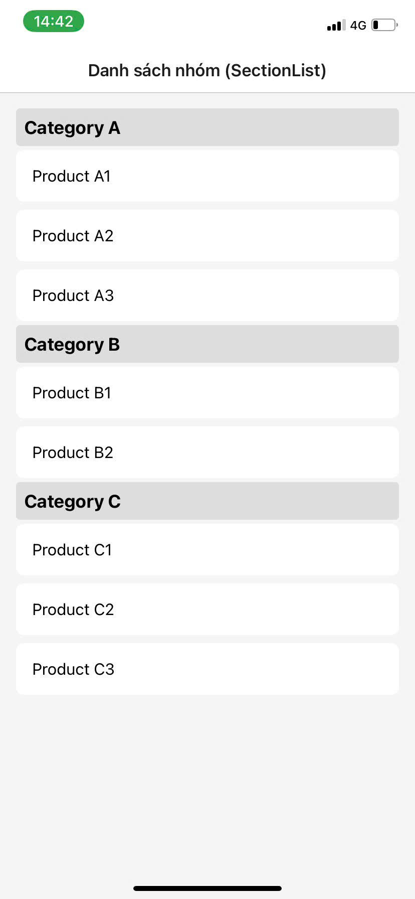

#Bùi Vũ Gia Bảo, msv:22810310140

#Kết quả bài tập:

# So sánh flatlist và sectionlist
## 1.Mục đích sử dụng:
### FlatList: Dùng để hiển thị danh sách phẳng của các item không có phân nhóm, mỗi item đều độc lập với nhau.
### SectionList: Dùng để hiển thị danh sách có phân nhóm, trong đó mỗi nhóm chứa một danh sách con các item.
## 2.Cấu trúc dữ liệu:
### FlatList: Dữ liệu được cung cấp dưới dạng một mảng một chiều, với các item là các phần tử độc lập.
### SectionList: Dữ liệu chứa các nhóm với danh sách con của các item bên trong mỗi nhóm.
## 3.Hiệu năng:
### FlatList: Hiệu suất cao khi cần hiển thị một danh sách lớn mà không cần phân nhóm.
### SectionList: Hiệu suất tốt khi hiển thị danh sách có các nhóm lớn với nhiều item trong mỗi nhóm.
## 4.Tính dễ sử dụng:
### FlatList: Dễ sử dụng, thích hợp cho các trường hợp khi bạn chỉ cần hiển thị một danh sách phẳng, dữ liệu đơn giản.
### SectionList: Cần cấu trúc dữ liệu phức tạp hơn vì cần phân nhóm và dữ liệu từng nhóm cần có title và data. Điều này đòi hỏi thêm công sức trong việc tổ chức và sắp xếp dữ liệu.
